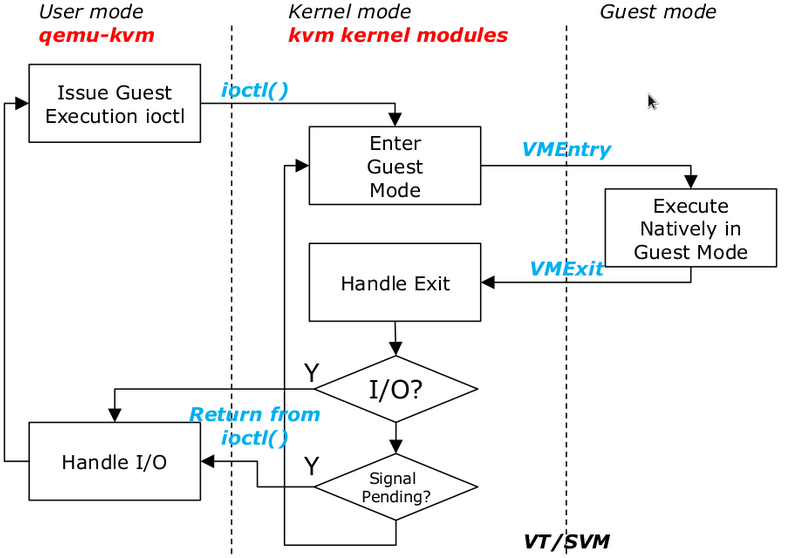

******
虚拟化
******

虚拟化本质就是松耦合，接口化。 加一个中间层。最简单的虚拟化就是 输入输出的重定向。 因为正常的情况下程序没有打开多余的输入输出的。只有0，1，2.程序只认0，1，2.不管他们绑在谁身上。

再复杂一些虚拟化chroot,这样上升到context的切换。 但还不够。程序最初的设计是代码与数据分离的。 但是代码与执行本身强耦合的。这也是为什么大部分情况下，一般人讲进程与代码的关系的讲不清的原因。

更进一步的虚拟就是代码，数据，执行三者都是分离的。因为当初的设计，代码的执行context要求比较大那就是 OS级的context. 也就是你看到虚拟机。有两种一种是 JVM这种。另一种那就是 virtual box以及更一层的Xen 这种。

从实现上只是执行与代码的分离，而在linux 中还出现多细分的。
`LXC: Linux 容器工具 <http://www.ibm.com/developerworks/cn/linux/l-lxc-containers/index.html>`_  这个实现正是基于chroot 实现的进程级别的虚拟化。
http://blog.csdn.net/cbmsft/article/details/7214371

Docker 是一种更轻质化的容器,就为了实现大一统,达到资源与效率的平衡.
Docker 可以做什么 http://blog.2baxb.me/archives/1136 

Docker
======

最快的安装方式，:command:`curl -sSL https://get.docker.com/ |sh -`
并且Docker现在发展的很成熟，可以实现各种level的虚拟化。

一个进程的，直接使用 :command:`docker run` 或者多进程service级别的docker-composer.
以及多host的docker-machine(自动安装docker）,以及集群水平的swarms,`Kubernetes <https://kubernetes.io/docs/concepts/overview/what-is-kubernetes/>`_ (google开发的自动部署的docker工具)，能够实现load labance. 同时能够提供虚拟的网络的，overlay.   

同时也提供自动配置，Dockerfile ,Compose.yaml 等等。 

对于数据存储资源可以 volume绑定.

对于docker image的存储可以有自建registery. 同时还有各家的docker cloud可以用。

#. 常用命令的查询 `Docker <https://github.com/eon01/DockerCheatSheet>`_ 
#. 中文版不错的书 `Docker 从入门到实践 <https://www.gitbook.com/book/yeasy/docker_practice/details>`_

#. Docker 的存储实现原理 https://segmentfault.com/a/1190000007168476，不同文件系统支持的水平与性能也都不一样。

dokcer 对于集群的支持 有Docker service,以及swarm等模式的支持。 http://liubin.org/blog/2016/06/17/whats-new-in-docker-1-dot-12-dot-0/

how to upload to hub.docker.com
===============================

.. code-block:: bash
   
   docker images 
   docker tag  bb38976d03cf yourhubusername/verse_gapminder:firsttry
   docker push yourhubusername/verse_gapminder:firsttry

how to automate-build from with Github
======================================

共享GUI与host
=============

主要是采用的方式，那就是共享socket 的模式。

permission
==========

.. code-block:: bash 

   docker: Got permission denied while trying to connect to the Docker daemon socket at unix:///var/run/docker.sock: Post http://%2Fvar%2Frun%2Fdocker.sock/v1.26/containers/create: dial unix /var/run/docker.sock: connect: permission denied.
   See 'docker run --help'.
   sudo usermod -a -G docker $USER
   logout/login

network and service
-------------------

docker --run --it --net=bridge
在Docker的container里起一个sshi serivice

.. code-block:: bash
    
   apt update && apt install openssh-server
   /usr/sbin/sshd
   #. config the sshd alow the root
   docker run -p  8022:22 

Grid 
====

#. vGPU profile 决定你的vGPU type.
   每一块物理卡可以虚拟出多块vGPU,但是必须是同一类型
   分配策略，深度优先，把一个块物理卡用完再用第二块卡，第二种广度优先，尽可能用新卡。

#. http://www.nvidia.com/object/nvidia-grid-buy.html
#. `NVIDIA GRID vGPU explained <https://www.youtube.com/watch?v=_CQmomyOiRM>`_

#. Windows server 2016 版本对比 https://docs.microsoft.com/zh-cn/windows-server/get-started/2016-edition-comparison

#. type 2 与type 1 的区别 https://blogs.technet.microsoft.com/jhoward/2013/10/24/hyper-v-generation-2-virtual-machines-part-1/

#. NVIDIA GRID 对Hyper-V 的支持
https://virtuallyvisual.wordpress.com/2017/01/18/nvidia-grid-and-microsoft-windows-server-oss-and-hyper-v/

#. Latest GRID 5.0 https://thevirtualhorizon.com/2017/08/17/grid-5-0-pascal-support-and-more/

steps

KVM
====

KVM kernel-based virtual machine,主要是内核支持GPU的virt-D等支持，本质也就是硬件上支持CPU的context切换，相当于current conext,以及其他context. 把内存其他管理等等还扔给linux kernel来进行。以及其他对IO设备的模拟QEMU。libvirt 库可直接用来操作。
CPU虚拟化通过VMX两个状态切换来实现虚拟化。 https://developer.aliyun.com/article/724399?spm=a2c6h.12873639.0.0.783322056v4fst。
内存的虚拟化通过EPT（Extended Page Tables，扩展页表），从而将客户机虚拟地址到宿主机物理地址的转换通过硬件来实现
  
  * 客户机虚拟地址，GVA（Guest Virtual Address）
  * 客户机物理地址，GPA（Guest Physical Address）
  * 宿主机虚拟地址，HVA（Host Virtual Address）
  * 宿主机物理地址，HPA（Host Physical Address）
而其他硬件虚拟化主要是通过QEMU来模拟，或者硬件的直接支持或者驱动的cs模式来支持 https://developer.aliyun.com/article/724399?spm=a2c6h.12873639.0.0.783322056v4fst

QEMU 基本原理就是通过hook ioctl接口来实现。

.. image::
   
   https://ucc.alicdn.com/pic/developer-ecology/a363969e35d3441eab73ac7fdb660015.png

